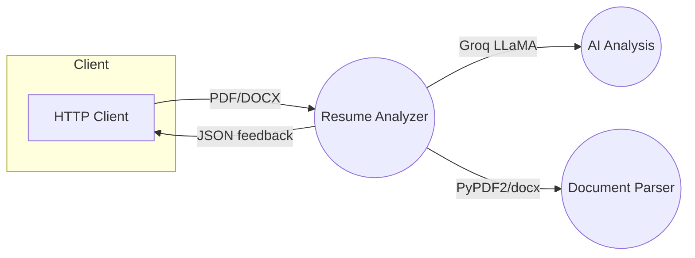
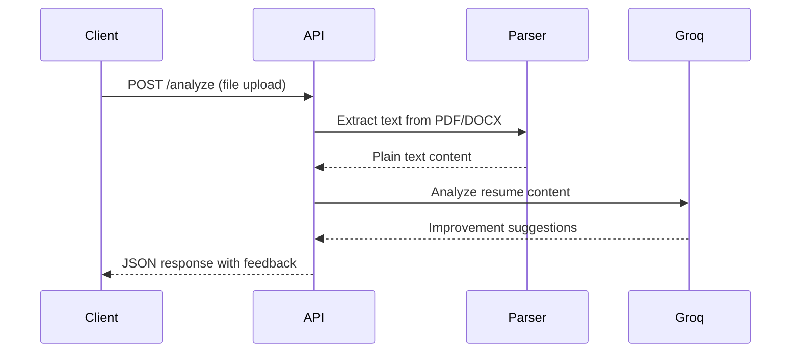

# AI Resume Improvement Micro-Service

AI-powered resume analysis service that provides intelligent improvement suggestions. Accepts PDF and DOCX files, analyzes content using Groq's LLaMA model, and returns structured feedback for resume enhancement.

## 1. Scope

- Analyze resume content from PDF and DOCX files
- Extract text and process with AI for improvement suggestions
- Provide structured JSON responses with actionable feedback
- Support both file upload and direct text analysis

## 2. High-Level Architecture



## 3. Component Breakdown

| Layer | Module | Responsibility |
|-------|--------|----------------|
| API | FastAPI & Uvicorn | Handle HTTP requests and file uploads |
| Parser | PyPDF2 & python-docx | Extract text from PDF and DOCX files |
| AI | Groq LLaMA-3.1-8b | Analyze resume content and generate suggestions |
| Core | LangChain | Orchestrate AI processing pipeline |

## 4. API Contract

### Base URL
```
http://<host>:8000
```

### Endpoints

#### GET /
```json
{
  "message": "Resume Analyzer API",
  "version": "1.0.0",
  "endpoints": {
    "/analyze": "POST - Upload and analyze resume file (PDF or DOCX)"
  }
}
```

#### POST /analyze
**Request:** Multipart form data with file upload
```
Content-Type: multipart/form-data
file: <PDF or DOCX file>
```

**Response:**
```json
{
  "status": "success",
  "filename": "resume.pdf",
  "file_type": "pdf",
  "improvements": {
    "1": "add projects section",
    "2": "improve work experience descriptions",
    "3": "enhance technical skills formatting"
  }
}
```

#### POST /analyze-text
**Request:**
```json
{
  "text": "resume content as plain text"
}
```

**Response:**
```json
{
  "status": "success",
  "improvements": {
    "1": "add quantifiable achievements",
    "2": "improve action verbs usage"
  }
}
```

### Error Responses
```json
{
  "detail": "Error message description"
}
```

## 5. How It Works

### Processing Flow
1. **File Upload** - Client uploads PDF/DOCX resume via `/analyze` endpoint
2. **File Validation** - System validates file type (PDF or DOCX only)
3. **Text Extraction** - PyPDF2 or python-docx extracts plain text from document
4. **AI Analysis** - Groq LLaMA-3.1-8b analyzes resume content using expert prompt
5. **Response Parsing** - System parses AI response into structured JSON format
6. **Result Return** - Client receives numbered improvement suggestions

### AI Prompt Strategy
The system uses a specialized prompt that:
- Acts as an expert resume reviewer
- Identifies critical improvement points only
- Returns suggestions in strict JSON format with numbered keys
- Focuses on actionable, specific feedback

### Error Handling
- Invalid file types return 400 error
- Empty files or extraction failures are caught
- AI response parsing failures return raw response with note
- All exceptions return structured error messages

## 6. Sequence Diagram



## 7. Use-Cases

- **Job seekers** – Get AI-powered feedback to improve resume quality
- **Career counselors** – Automated initial resume screening and suggestions
- **HR departments** – Bulk resume analysis and standardization
- **Educational institutions** – Help students optimize their resumes

## 8. Requirements

### Functional
- Accept PDF and DOCX files up to standard size limits
- Extract text content accurately from documents
- Generate relevant improvement suggestions using AI
- Return structured JSON responses

### Non-Functional
- Response time <5 seconds for typical resume files
- Support concurrent file processing
- Secure handling of uploaded documents
- Memory efficient document processing

### System Requirements Specification (SRS)

| ID | Requirement | Priority |
|----|-------------|----------|
| FR-1 | The system shall accept PDF and DOCX file uploads | Must |
| FR-2 | The system shall extract text from uploaded documents | Must |
| FR-3 | The system shall analyze content using Groq AI model | Must |
| FR-4 | The system shall return structured improvement suggestions | Must |
| NFR-1 | The system shall run on Windows/Linux with Python 3.9+ | Must |
| NFR-2 | The system should process files within 5 seconds | Should |
| SEC-1 | The system should validate file types before processing | Should |

## 9. Requirements.txt

Core dependencies:
```
fastapi==0.116.1
uvicorn==0.35.0
langchain==0.3.27
langchain-groq==0.3.6
langchain-core==0.3.72
python-dotenv==1.1.1
PyPDF2==3.0.1
python-docx==1.2.0
groq==0.30.0
```

## 10. Environment Setup

Create a `.env` file:
```
Groq=your_groq_api_key_here
```

## 11. Running Locally

```bash
# Create virtual environment
python -m venv env
env\Scripts\activate  # Windows
# source env/bin/activate  # Linux/Mac

# Install dependencies
pip install -r requirements.txt

# Set up environment variables
# Create my.env file with your Groq API key

# Run the application
python ai_module.py.py
```

The service will be available at `http://localhost:8000`

## 12. API Testing

### Using curl:
```bash
# Test file upload
curl -X POST "http://localhost:8000/analyze" \
  -H "accept: application/json" \
  -H "Content-Type: multipart/form-data" \
  -F "file=@resume.pdf"

# Test text analysis
curl -X POST "http://localhost:8000/analyze-text" \
  -H "Content-Type: application/json" \
  -d '{"text": "Your resume content here"}'
```

---

© 2025 Nexterse